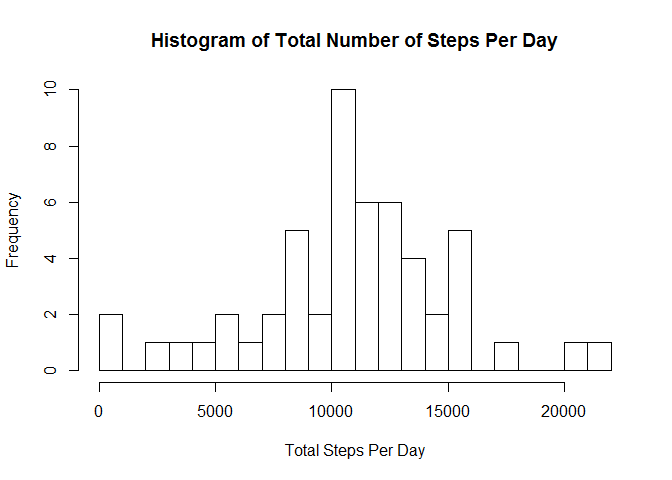
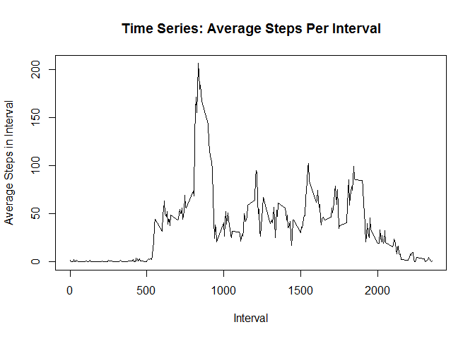
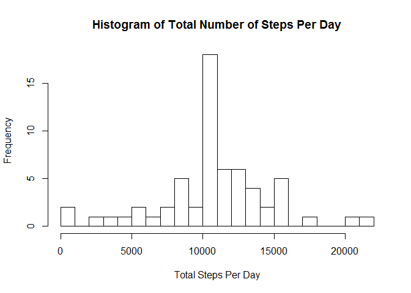
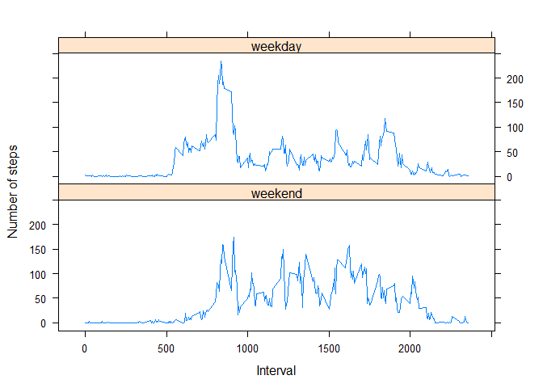

# Reproducible Research: Peer Assessment 1

## Loading and preprocessing the data

```r
## Read csv into activity data frame
activity<-read.csv("activity.csv")

## Transform the date field into a date class
activity$date<-as.Date(as.character(activity$date),"%Y-%m-%d")
```

## What is mean total number of steps taken per day?

```r
## Ignoring missing values, plot histogram of total steps per day
completeactivity<-activity[complete.cases(activity),]
activitybyday<-with(completeactivity,tapply(steps,date,sum))
activitybyday<-data.frame(date=names(activitybyday),totalsteps=activitybyday)
avgsteps<-mean(activitybyday$totalsteps,na.rm=TRUE)
mediansteps<-median(activitybyday$totalsteps,na.rm=TRUE)
hist(activitybyday$totalsteps,30,
     main="Histogram of Total Number of Steps Per Day",xlab="Total Steps Per Day")
```

<!-- -->

The mean total number of steps taken per day is 10,766.19.

The median total number of steps taken per day is 10,765.

## What is the average daily activity pattern?

```r
## Ignoring missing values, make a time series plot of average steps per interval
activitydaily<-with(completeactivity,tapply(steps,as.factor(interval),mean))
activitydaily<-data.frame(interval=names(activitydaily),avgsteps=activitydaily)
with(activitydaily,plot(as.numeric(as.character(interval)),avgsteps,type="l",
                        xlab="Interval",ylab="Average Steps in Interval",
                        main="Time Series: Average Steps Per Interval"))
```

<!-- -->

```r
## Compute the maximum number of steps and the interval at which it occurred
maxstepsindex<-as.numeric(as.character(activitydaily[which.max(activitydaily$avgsteps),]$interval))
maxsteps<-max(activitydaily$avgsteps)
```

The 5-minute interval starting at 8:35, on average across all the days in the dataset, contains the maximum number of steps, which is 206.17.

## Imputing missing values

```r
missingvalues<-sum(is.na(activity$steps))
```
The total number of missing values in the dataset is 2,304.


```r
## Fill in the missing data in the original dataset using the mean for each 5-minute interval.
newactivity<-activity
missingdata<-which(is.na(newactivity$steps))
for(i in missingdata) {
	newactivity[i,1]<-subset(activitydaily,interval==newactivity[i,3])$avgsteps
}
## Using the updated dataset, plot histogram of total steps per day
newactivitybyday<-with(newactivity,tapply(steps,date,sum))
newactivitybyday<-data.frame(date=names(newactivitybyday),totalsteps=newactivitybyday)
newavgsteps<-mean(newactivitybyday$totalsteps)
newmediansteps<-median(newactivitybyday$totalsteps)
hist(newactivitybyday$totalsteps,30,
     main="Histogram of Total Number of Steps Per Day",xlab="Total Steps Per Day")
```

<!-- -->

The mean total number of steps taken per day is 10,766.19.

The median total number of steps taken per day is 10,766.19.

The mean value does not differ from the estimate in the original dataset, but the median does shift slightly. Since we filled in all of the missing data with the **means** of the original dataset, it seems the median shifted toward the mean, and the histogram is more densely populated in the center of the plot rather than the tails.

## Are there differences in activity patterns between weekdays and weekends?

```r
library(dplyr)
library(lattice)
```


```r
## Add "day" column to the activity data, and ignore missing data
activity<-mutate(activity,day=ifelse(weekdays(date) %in% c("Saturday","Sunday"),"weekend","weekday"))
completeactivity<-activity[complete.cases(activity),]

## Generate summary table for weekend vs weekday average number of steps
actsummary<-completeactivity %>%
  group_by(day, interval) %>%
  summarize(avgsteps=mean(steps))

## Plot the average number of steps for each time interval (wknd vs wkday)
xyplot(avgsteps ~ interval | day, actsummary, type="l", layout=c(1,2),
       index.cond=list(c(2,1)), xlab="Interval", ylab="Number of steps")
```

<!-- -->

There are a few differences in patterns and notable peaks/troughs in the weekday versus weekend data. On average, activity starts earlier in the day on the weekdays compared to weekends. There is a larger peak at around 9am during the weekdays; this peak is larger than any other average total number of steps during the weekend. On average, weekends see more consistent activity throughout the day than weekdays, with the last peak occurring past 8pm, whereas the last peak on weekdays is on average before 8pm.
